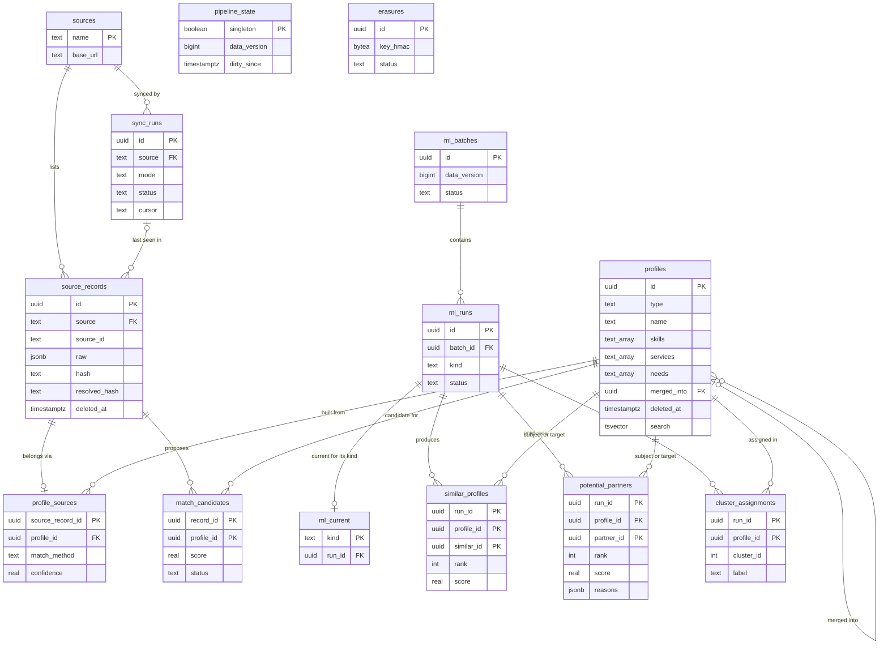

# ER diagram

Column details are in `db/migrations`. `pipeline_state` (one row) and `erasures`
(the blocklist) have no foreign keys.

```mermaid
erDiagram
  sources ||--o{ source_records : lists
  sources ||--o{ sync_runs : "synced by"
  sync_runs |o--o{ source_records : "last seen in"
  source_records ||--o| profile_sources : "belongs via"
  profiles ||--o{ profile_sources : "built from"
  profiles |o--o{ profiles : "merged into"
  source_records ||--o{ match_candidates : proposes
  profiles ||--o{ match_candidates : "candidate for"
  ml_batches ||--o{ ml_runs : contains
  ml_runs ||--o| ml_current : "current for its kind"
  ml_runs ||--o{ similar_profiles : produces
  ml_runs ||--o{ potential_partners : produces
  ml_runs ||--o{ cluster_assignments : produces
  profiles ||--o{ similar_profiles : "subject or target"
  profiles ||--o{ potential_partners : "subject or target"
  profiles ||--o{ cluster_assignments : "assigned in"

  sources {
    text name PK
    text base_url
  }
  source_records {
    uuid id PK
    text source FK
    text source_id
    jsonb raw
    text hash
    text resolved_hash
    timestamptz deleted_at
  }
  profiles {
    uuid id PK
    text type
    text name
    text_array skills
    text_array services
    text_array needs
    uuid merged_into FK
    timestamptz deleted_at
    tsvector search
  }
  profile_sources {
    uuid source_record_id PK
    uuid profile_id FK
    text match_method
    real confidence
  }
  match_candidates {
    uuid record_id PK
    uuid profile_id PK
    real score
    text status
  }
  sync_runs {
    uuid id PK
    text source FK
    text mode
    text status
    text cursor
  }
  ml_batches {
    uuid id PK
    bigint data_version
    text status
  }
  ml_runs {
    uuid id PK
    uuid batch_id FK
    text kind
    text status
  }
  ml_current {
    text kind PK
    uuid run_id FK
  }
  similar_profiles {
    uuid run_id PK
    uuid profile_id PK
    uuid similar_id PK
    int rank
    real score
  }
  potential_partners {
    uuid run_id PK
    uuid profile_id PK
    uuid partner_id PK
    int rank
    real score
    jsonb reasons
  }
  cluster_assignments {
    uuid run_id PK
    uuid profile_id PK
    int cluster_id
    text label
  }
  pipeline_state {
    boolean singleton PK
    bigint data_version
    timestamptz dirty_since
  }
  erasures {
    uuid id PK
    bytea key_hmac
    text status
  }
```
